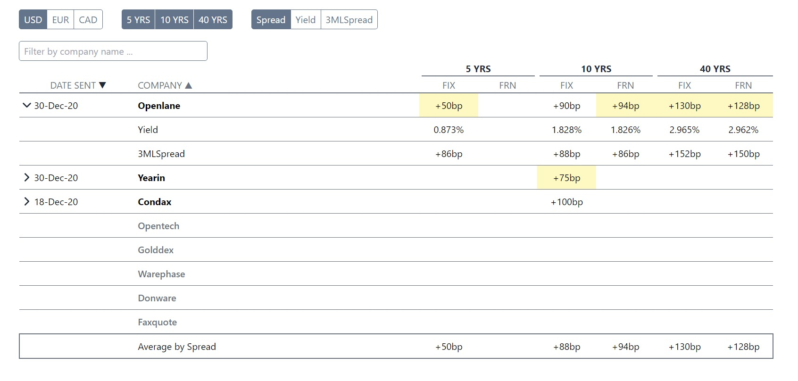
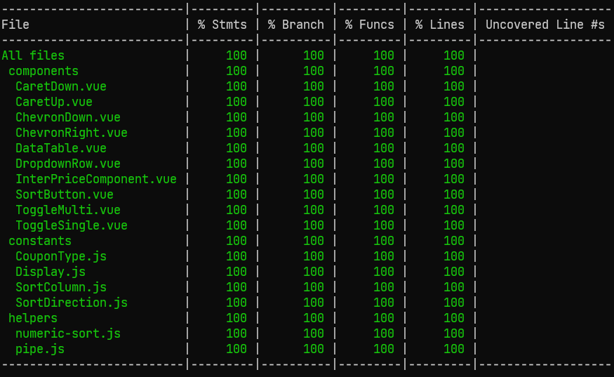
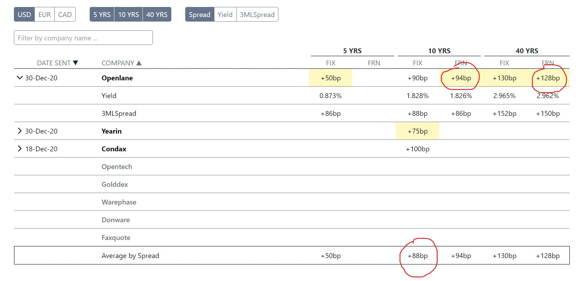

# InterPrice Developer Test

Final:



Mockup:


Code coverage:




## Remarks

A few things that do not match the mockup 100%:

- USD; 10 Years, FIX, **Average by Spread is +88bp, not +72bp as is in the mockup.** Avg of [90, 75, 100] = 265 (sum) / 3 (number of items) = 88,33333333333333.
- "Minimal values (by column) of each primary row should be highlighted." - In the mockup for USD; Spread; only +50bp, +75bp and +130bp are highlighted, but according to the task values +94bp and +128bp should also be highlighted since they are minimum values for that year/couponType.
- Y Padding on the bottom border bellow the YRS cells seems off in the mockup. The first column has padding on the left and right, and is offset in regard to the value cell bellow, but the second column also has some padding but the value cell bellow does not seem to be affected.




## Project Setup

```sh
npm install
```

### Compile and Hot-Reload for Development

```sh
npm run dev
```

### Compile and Minify for Production

```sh
npm run build
```

### Run Unit Tests with [Vitest](https://vitest.dev/)

Useful resource when writting tests:     
https://v1.test-utils.vuejs.org/api/wrapper/

```sh
npm run test:unit

# code coverage
npm run test:unit:coverage
```

### Lint with [ESLint](https://eslint.org/)

```sh
npm run lint
```
